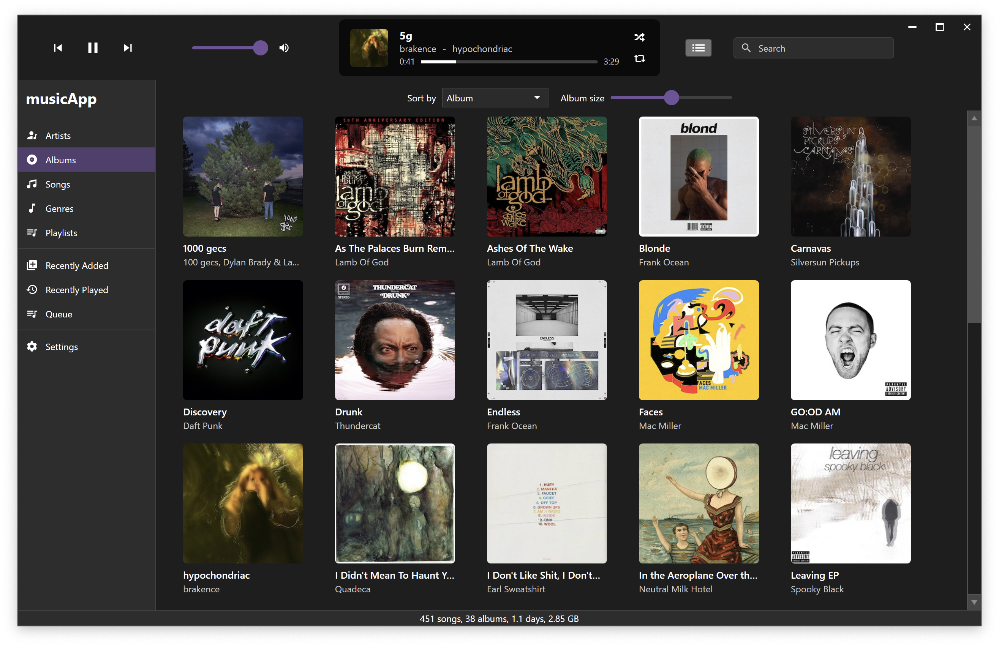
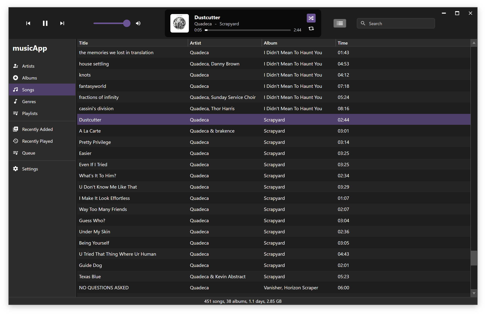
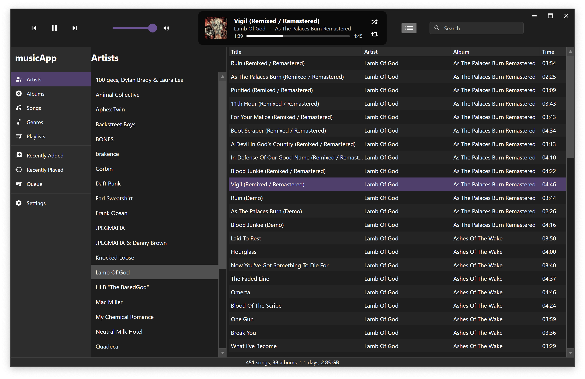
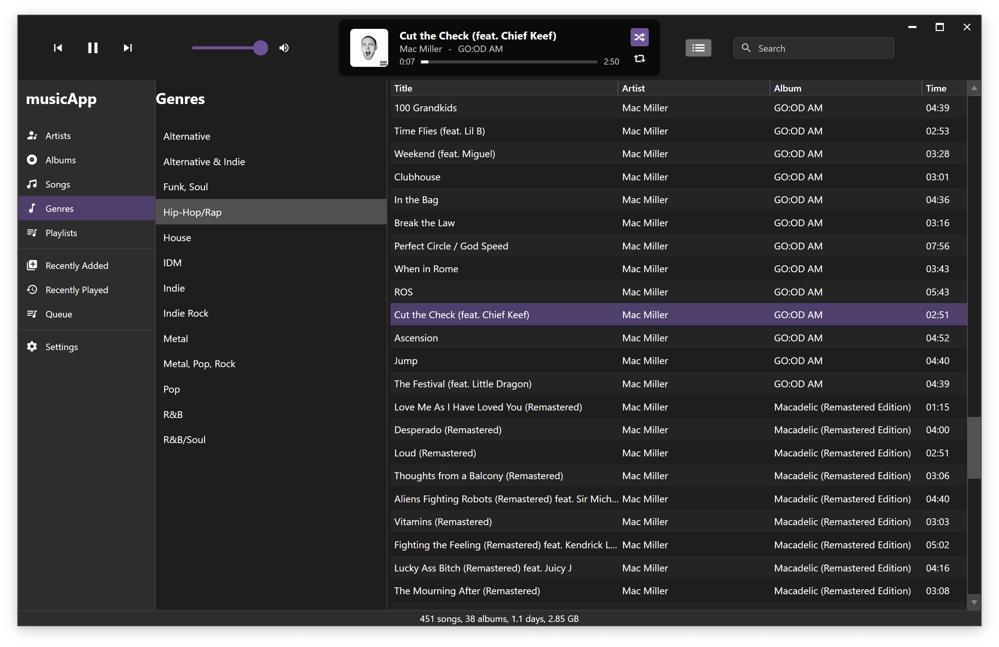
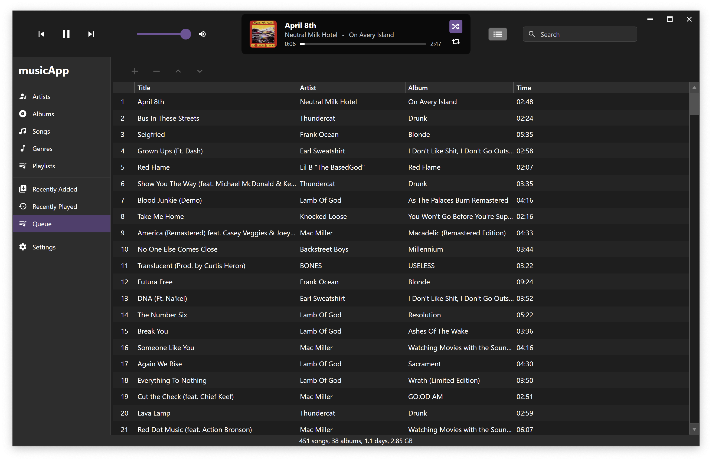
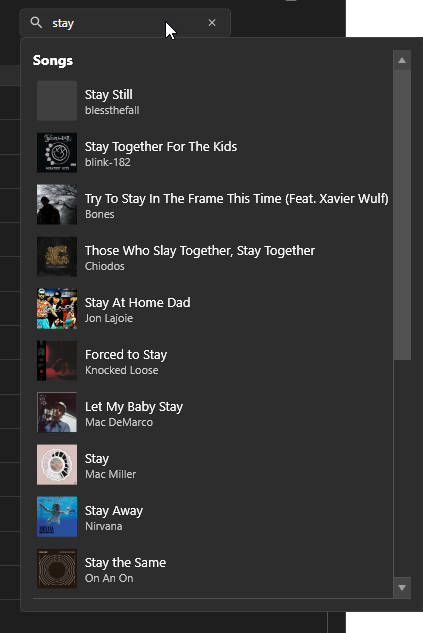
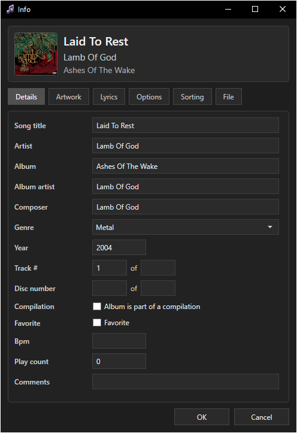

#  musicApp - an offline music player

Desktop music player for Windows with a focus on functionality, efficiency, clean UI, and customization.

Currently in a pre-release state, so not all intended features or behaviors have been added or thoroughly tested. You can track the current progress below.

## Progress

  
**132 / 169 tasks complete (78.1%)**
[Tasks.md](https://github.com/fosterbarnes/musicApp/blob/main/.md/Tasks.md#main-window)

[30,838](https://github.com/fosterbarnes/musicApp/blob/main/.md/scc.txt) lines of code and counting...

## Downloads

This project is in early development, bugs are expected. Windows only (for now).

<table border="0">
<tbody>
<tr>
<td valign="top"></td>
<td valign="top"></td>
<td valign="top"></td>
</tr>
<tr>
<td valign="top"></td>
</tr>
</tbody>
</table>

## Screenshots

| <h3>Albums</h3> |
|:---:|
|  |

| <h3>Songs</h3> |
|:---:|
|  |

| <h3>Artists</h3> |
|:---:|
|  |

More Screenshots:

| <h3>Genres</h3> |
|:---:|
|  |

| <h3>Playlists</h3> |
|:---:|
|  |

| <h3>Recently Played</h3> |
|:---:|
|  |

| <h3>Queue</h3> |
|:---:|
|  |

| <h3>Search</h3> |
|:---:|
|  |

| <h3>Info</h3> |
|:---:|
|  |

## Why does this exist?

I dislike streaming services. I have tried many music player apps like Foobar2000,
Musicbee, AIMP, Clementine, Strawberry, etc. and just they're not for me. No disrespect to the creators, they're clearly very well-built apps. I like (tolerate) iTunes, and while it IS functional and has a ui that I find better than the alternatives, it's very out of date, sluggish overall and can cause other weird issues with other applications.

To be honest, this app is made so I can use as my daily music player. HOWEVER, if you agree with one or more of the previous statements, this app may also be for you too. It's made for Windows with WPF in C#, for this reason, Linux/macOS versions are not currently planned. My main concern is efficiency for my personal daily driver OS (Windows 10) not cross compatibility. The thought of making such a detailed and clean UI in Rust (my cross compat. language of choice) gives me goosebumps and shivers, ergo: WPF in C#, using XAML for styling.

## Compatibility

| Platform  | Architecture   |
|------------|-----------------|
| Windows 10 | x86, x64, arm64 |
| Windows 11 | x86, x64, arm64 |

## Planned Ports

| Platform  | Architecture   |
|------------|-----------------|
| Debian Linux | x64, arm64 |
| macOS | x64, arm64 |

## Support

If you have any issues, create an issue from the [Issues](https://github.com/fosterbarnes/rustitles/issues) tab and I will get back to you as quickly as possible.

If you'd like to support me, follow me on twitch:
[https://www.twitch.tv/fosterbarnes](https://www.twitch.tv/fosterbarnes)
