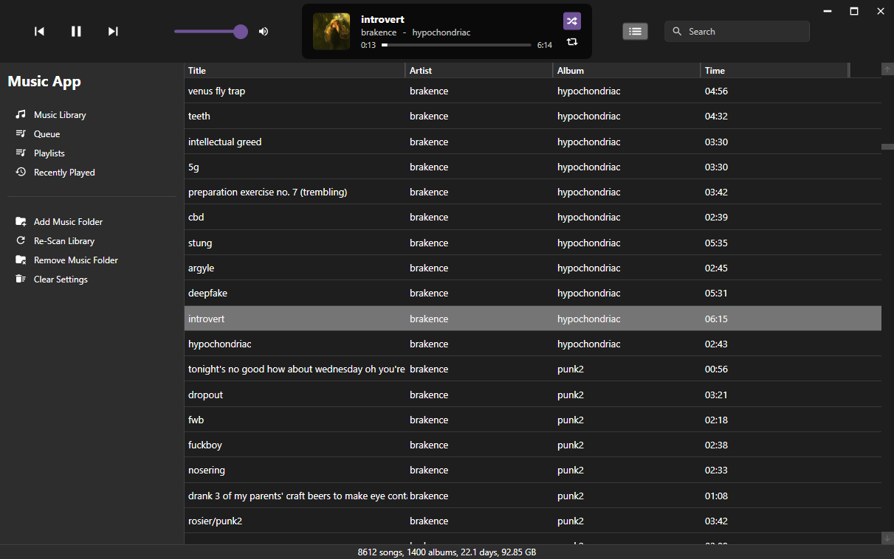

#  musicApp - an offline music player

<td></td>

musicApp is in very early development. This repo mainly exists as an archive/backup of my daily progress.,feel free to try it out but don't expect a complete app. Bugs are expected.

If you want to use it, [download the latest release](https://github.com/fosterbarnes/MusicApp/releases), unzip, then run MusicApp.exe

## Progress

  
**36 / 63 tasks complete (57%)**

Tasks

- ~~Working audio playback with various file types. Lossless support~~
- ~~Working music library (add/remove/clear media folders)~~
- ~~Auto-rescan music library upon app launch.~~
- ~~Combined title/media control bar. Includes:~~
  - ~~Reverse, play/pause and skip buttons.~~
  - ~~Volume control slider~~
  - ~~Currently playing track viewport with seek bar and song info.~~
  - ~~Currently playing track section auto-centers and resizes based on window size.~~
  - ~~Queue button (placeholder)~~
  - ~~Search bar (placeholder)~~
  - ~~Minimize, maximize, and close buttons~~
- ~~Playlists:~~
  - ~~Add/remove playlists~~
  - ~~Import/export .m3u files~~
- ~~Basic recently played menu~~
- ~~Shuffle and repeat~~
- ~~Active queue~~
- ~~Basic context menu:~~
  - ~~Play Next~~
  - ~~Add to Queue~~
  - ~~Add to Playlist~~
    - ~~New Playlist~~
    - ~~Add to existing playlist~~
    - ~~Remove from Playlist~~
  - Info
  - ~~Show in Explorer~~
  - ~~Remove from Library~~
  - ~~Delete~~
- Settings menu:
  - EQ
  - Multiple audio backends
  - Themes/colors
  - Cross-fading between songs
  - Volume normalization
  - Sample rate
- Ability to edit metadata
- Visualizer
- Playlist import support
- _POSSIBLE_ iTunes library import support
- Audio file converting/compressing
- Album art scraper
- Optional metadata correction/cleanup
- Robust queuing system/menu. I like to make "on the fly" playlists with my queues, so it must be as seamless and robust as possible
- "Like" system and liked tracks menu
- Keyboard shortcuts for actions like "play/pause", "skip" "volume up/down" etc. These should work whether or not the app window is focused
- Mini-player window that can be open in addition to the main window, or as a replacement to the main window
- Support for multiple libraries
- Option to add "Add to musicApp" to windows right-click context menu
- Separate artist, album, songs, recently added and genre menus/lists
  - Large thumbnails for album and recently added menus with a "drop-down" view when clicked
  - List view for songs and genre menus
  - Combined list/thumbnail view for artists menu. Artists will be displayed in a list, their albums will be sorted and shown with large thumbnails similar to the dropdown when clicked in album view
- Light and dark mode options. Default is dark mode
- Multiple color themes (1st priority being mint green for my girlfriend), this will also change the icon
- Allow the user to click the artist or album name from the currently playing song view. Clicking will open the respective item in the library
- Move search to the title bar
- Last.fm support
- Possible media server integration (primarily emby/jellyfin because that's what I use)
- Automatic updates integrated with GitHub releases
- Installer
- Option for portable version
- Playlist menu: replace default windows popup with built in gui animation
- Expand clickable area for moving " | " dividers

## Implemented Features

- Working audio playback with various file types. Lossless support
- Working music library (add/remove/clear media folders)
- Auto-rescan music library upon app launch.
- Combined title/media control bar. Includes:
  - Reverse, play/pause and skip buttons.
  - Volume control slider
  - Currently playing track viewport with seek bar and song info.
  - Currently playing track section auto-centers and resizes based on window size.
  - Queue button (placeholder)
  - Search bar (placeholder)
  - Minimize, maximize, and close buttons
- Playlists:
  - Add/remove playlists
  - Import/export .m3u files
- Basic recently played menu
- Shuffle and repeat
- Basic queue view

## Planned Features

#### General/Playback

- Settings menu:- 
  - EQ
  - Multiple audio backends
  - Themes/colors
  - Cross-fading between songs
  - Volume normalization
  - Sample rate
- Ability to edit metadata
- Visualizer
- Playlist import support
- _POSSIBLE_ iTunes library import support
- Audio file converting/compressing
- Album art scraper
- Optional metadata correction/cleanup
- Robust queuing system/menu. I like to make "on the fly" playlists with my queues, so it must be as seamless and robust as possible
- "Like" system and liked tracks menu
- Keyboard shortcuts for actions like "play/pause", "skip" "volume up/down" etc. These should work whether or not the app window is focused
- Mini-player window that can be open in addition to the main window, or as a replacement to the main window
- Support for multiple libraries
- Option to add "Add to musicApp" to windows right-click context menu
- Spotify integration

#### Menu/UI

- Separate artist, album, songs, recently added and genre menus/lists
  - Large thumbnails for album and recently added menus with a "drop-down" view when clicked
  - List view for songs and genre menus
  - Combined list/thumbnail view for artists menu. Artists will be displayed in a list, their albums will be sorted and shown with large thumbnails similar to the dropdown when clicked in album view
- Light and dark mode options. Default is dark mode
- Multiple color themes (1st priority being mint green for my girlfriend), this will also change the icon
- Playlist menu: replace default windows popup with built in gui animation
- Expand clickable area for moving " | " dividers

#### Title Bar

- Allow the user to click the artist or album name from the currently playing song view. Clicking will open the respective item in the library
- Move search to the title bar

#### Integration

- Last.fm support
- Possible media server integration (primarily emby/jellyfin because that's what I use)

#### Backend/Boring Stuff

- Automatic updates integrated with GitHub releases
- Installer
- Option for portable version

## Why does this exist?

I hate streaming services. I have tried SO many music player apps like Foobar2000,
Musicbee, AIMP, Clementine, Strawberry, etc. and just don't like them. No disrespect to the creators but they're just not for me. I tolerate iTunes, and while it is functional and has a UI that I find more functional than the alternatives, it's very out of date, sluggish overall and (for some reason????) makes my twitch stream lag when I play music with it lmao (I'm a twitch streamer).

To be honest, this app is made so I can use as my daily music player. HOWEVER, if you agree with one or more of the previous statements, this app may also be for you too lol. It's made for Windows with WPF in C#, for this reason, Linux/macOS versions are not currently planned. My main concern is efficiency for my personal daily driver OS (Windows 10) not cross compatibility. The thought of making such a detailed and clean UI in Rust (my cross compat. language of choice) gives me goosebumps and shivers, ergo: WPF in C#, using XAML for styling.

## Support

If you have any issues, create an issue from the [Issues](https://github.com/fosterbarnes/rustitles/issues) tab and I will get back to you as quickly as possible.

If you'd like to support me, follow me on twitch:
[https://www.twitch.tv/fosterbarnes](https://www.twitch.tv/fosterbarnes)

or if you're feeling generous drop a donation:
[https://coff.ee/fosterbarnes](https://coff.ee/fosterbarnes)
